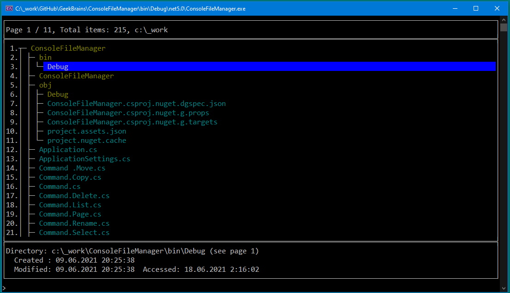

# ConsoleFileManager

This app allows: 
1. Browse the file structure page by page with a depth of no more than 2.  
2. Navigate throughout the file structure. 
3. Change file/directory names. 
4. Change the location of files/directories.
5. Delete files/directories.
6. Set page size (paging).
7. Make selection in the file structure by specifying the line number or file/folder name and view information about it.
6. Save/restore last app state before user exited: 
    - current directory,
    - selected item,
    - page size.

## Available commands

*Remark:* If the file name contains spaces, you must surround it with quotes: "item_full_path".

###  h, help         - shows help text

- h           - *shows commands list*
- h &lt;command&gt; - *shows help for &lt;command&gt;*

### s, sel, select  - changes selection

- s                   - *clear selection*
- s &lt;item_order_number&gt; - *set selection to &lt;item_order_number&gt;*
- s &lt;item_full_path&gt; - *set selection to &lt;item_full_path&gt;*

### pg, page        - sets and changes page size

- pg &lt;N&gt; - *sets page size as N lines*

###  ls, list        - lists all files and folders

- ls                  - *views disks list*
- ls .                - *reloads file list*
- ls -p &lt;N&gt;             - *views page &lt;N&gt;*
- ls &lt;directory&gt;      - *show files and folders in folder &lt;directory&gt;*
- ls &lt;directory&gt; -p &lt;N&gt; - *same as above and view page &lt;N&gt;*
- ls -p &lt;N&gt; &lt;directory&gt; - *same as above*

###  mkdir, makedir  - creates new folder

- mkdir &lt;path&gt; - *creates folder*

###  ren, rename     - changes name of file or folder

- ren &lt;new_name&gt;                  - *renames selected file or folder*
- ren &lt;original_name&gt; &lt;new_name&gt;  - *renames original file/folder to new one.*

### cp, copy        - copies file or folder

- cp &lt;target&gt;          - *copies selected file to folder &lt;target&gt;*
- cp &lt;source&gt; &lt;target&gt; - *copy &lt;source&gt; file/folder to &lt;target&gt; file/folder*

### mv, move        - moves file or folder

- mv &lt;target&gt;          - *moves selected file to folder &lt;target&gt;*
- mv &lt;source&gt; &lt;target&gt; - *moves file/folder to folder &lt;target&gt;*

### del, delete     - deletes file or folder

- del &lt;path&gt; - *delete file/folder.*
